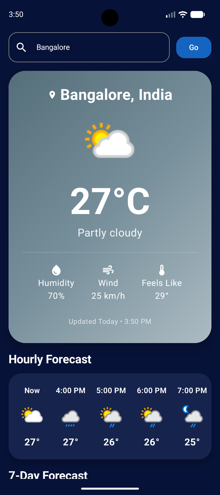
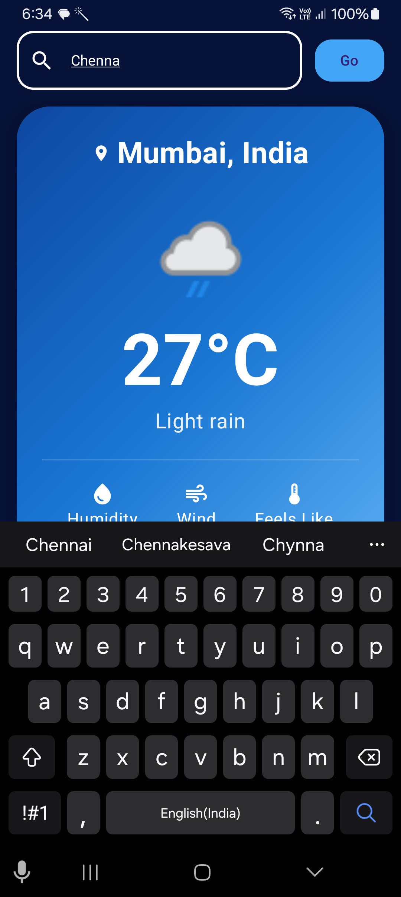
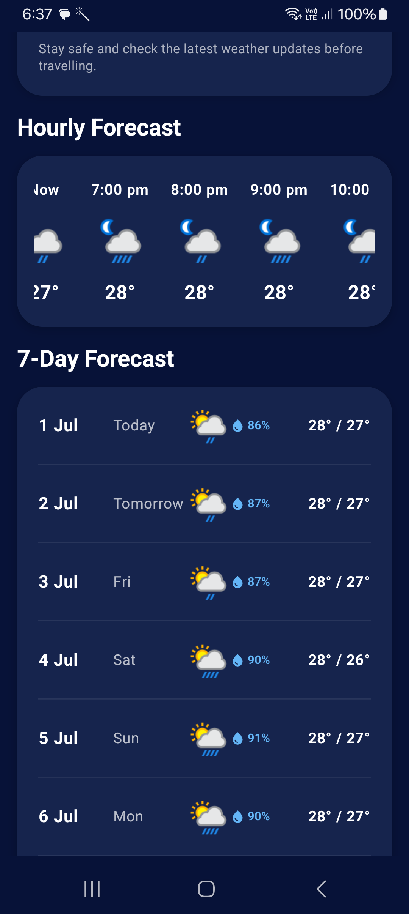
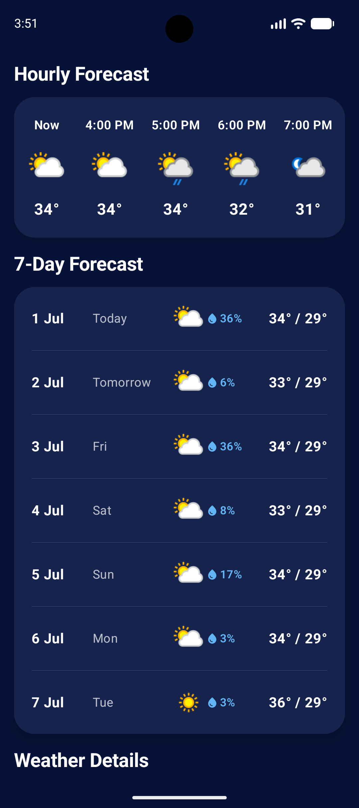
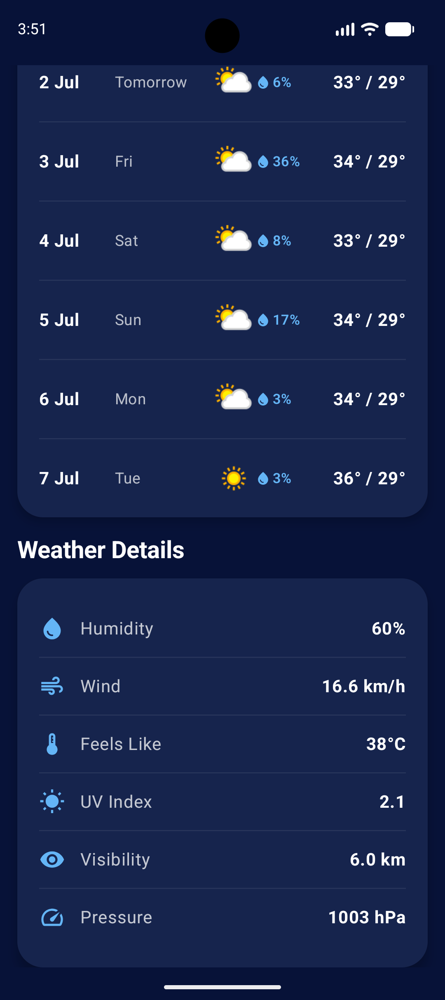
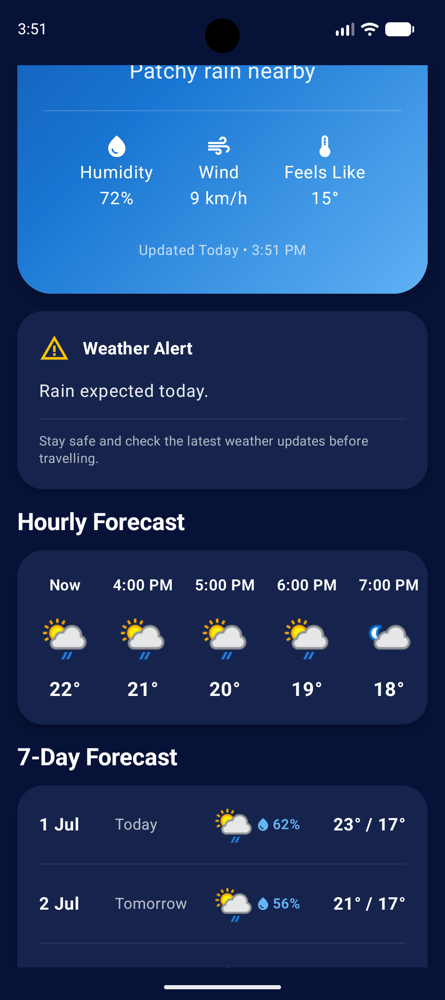
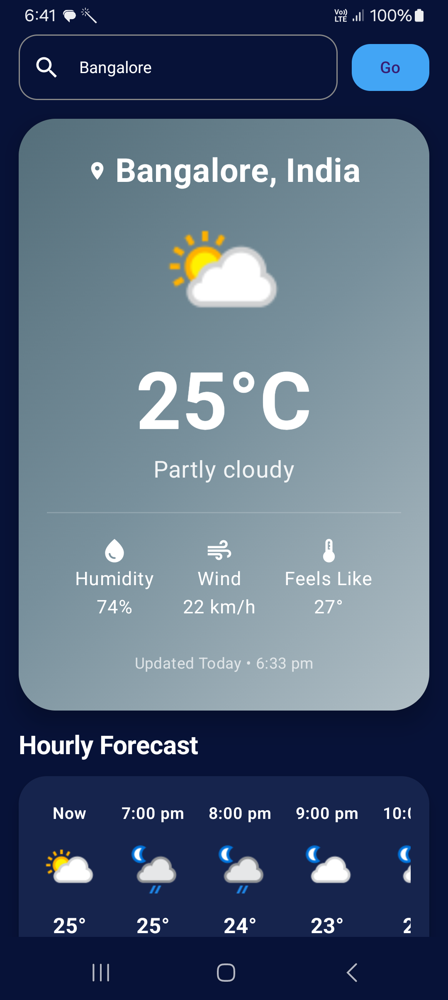
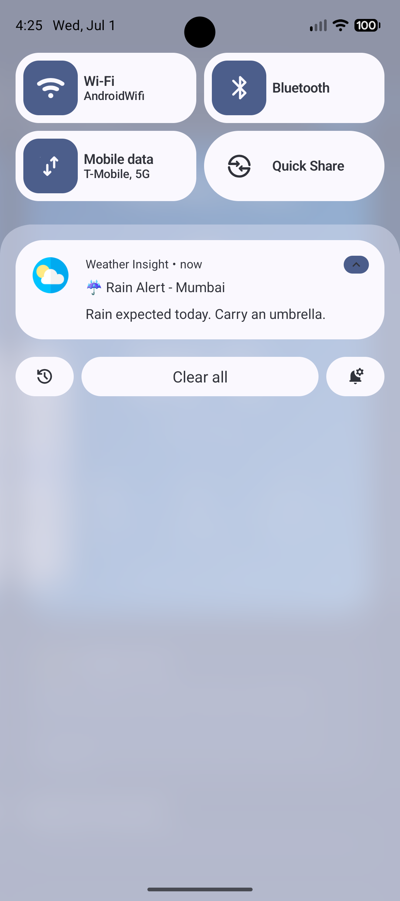
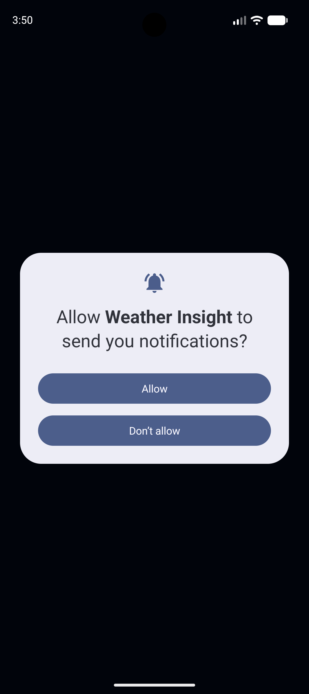
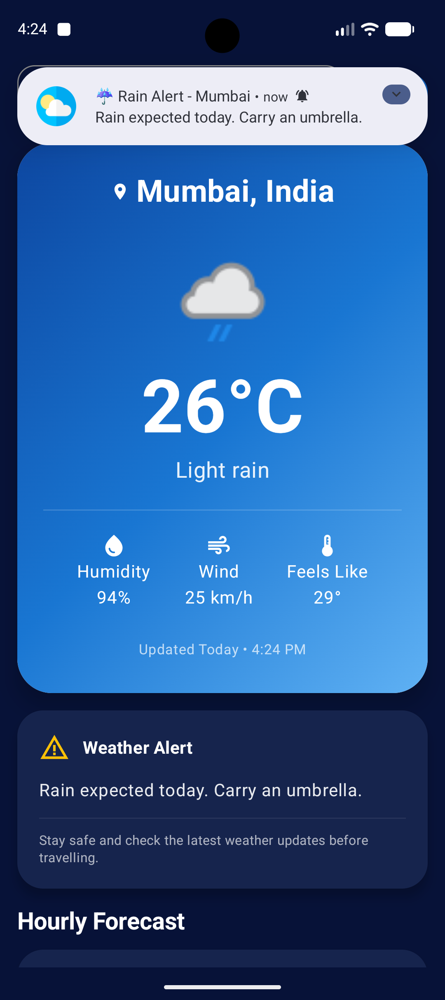

# 🌦️ Weather Insight

A modern Android Weather application built using **Kotlin**, **Jetpack Compose**, **MVVM**, **Clean Architecture**, **Hilt**, **Room**, **Retrofit**, and **WorkManager**. The application provides current weather, hourly and weekly forecasts, offline-first data access, intelligent cache management, and background weather notifications.

---

## ✨ Features

- 🌤 Current Weather
- 🔍 Search Weather by City
- 🕒 Hourly Forecast
- 📅 7-Day Weather Forecast
- 💾 Offline-First Cache (Room Database)
- 🔄 Pull to Refresh
- ⚡ Smart TTL Cache Refresh
- 🔔 Background Weather Sync (WorkManager)
- ⚠ Severe Weather Notifications
- 🚨 Dynamic Weather Alert Card
- 🎨 Modern Material 3 UI
- 🌙 Dynamic Weather Icons

---

## 📸 Screenshots

<p align="center">
  
  
  
</p>

<p align="center">
  
  
  
</p>

<p align="center">
  
  
  
</p>

<p align="center">
  
  
</p>


---

## 🎥 Demo Video

[▶️ Watch Demo Video](video/WeatherInsightDemo.mp4)

----

## 🏗️ Architecture

The project follows **Clean Architecture** with the **MVVM** pattern.

```
Presentation (Compose UI)
        │
        ▼
ViewModel
        │
        ▼
Use Cases
        │
        ▼
Repository
      ┌──────────────┐
      ▼              ▼
 Room Database   Retrofit API
```

---

## 🛠️ Tech Stack

- Kotlin
- Jetpack Compose
- MVVM
- Clean Architecture
- Hilt
- Retrofit
- Room
- Coroutines
- Flow
- WorkManager
- Coil
- Material 3

---

## 📁 Project Structure

```
app
├── core
├── data
├── domain
├── di
└── presentation
```

---

## 🌐 Weather API

This project uses **WeatherAPI**.

https://www.weatherapi.com/

---

## 🚀 Setup Instructions

1. Clone the repository.
2. Open the project in Android Studio.
3. Add your WeatherAPI key to `local.properties`:

```properties
WEATHER_API_KEY=YOUR_API_KEY
```

4. Sync the project.
5. Build and run the application.

---

## 🔄 Smart Cache (TTL)

The application implements a **Time-To-Live (TTL)** caching strategy.

- Uses Room as the single source of truth.
- Refreshes data only when the cache expires.
- Reduces unnecessary API requests.
- Improves performance and supports offline usage.

---

## 🔔 Background Weather Sync

- Periodic background refresh using WorkManager.
- Detects severe weather conditions.
- Displays weather notifications for rain, storms, snow, and extreme heat.

---

## 🧪 Unit Testing

Repository business logic is covered using:

- JUnit
- Mockito
- Coroutines Test

---

## 🔮 Future Improvements

- Current Location Support
- Favorite Cities
- UI Testing
- Widget Support
- Weather Radar
- Wear OS Support

---

## 👨‍💻 Author

**Manojkumar P**